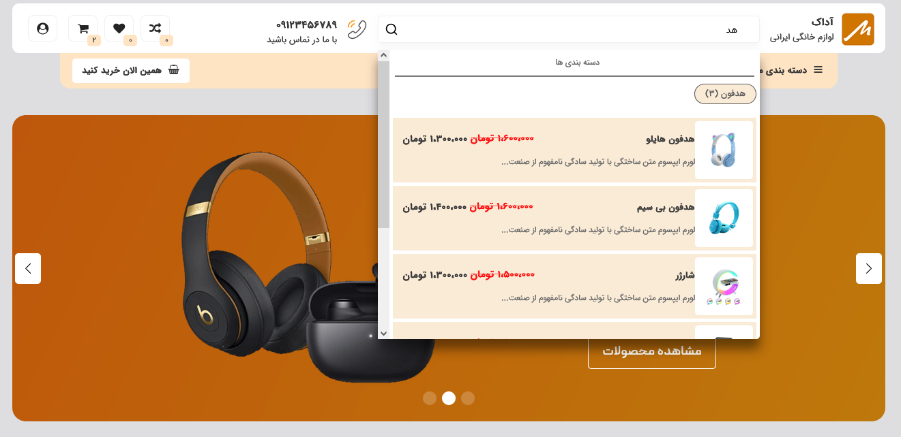
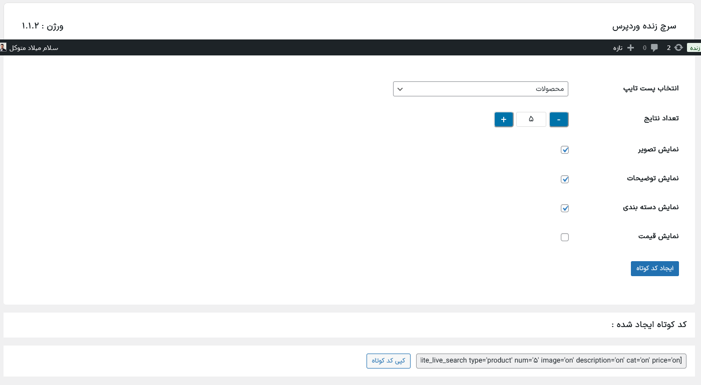

# Live Lite Search Plugin





[](https://opensource.org/licenses/GPL-2.0)
[](https://wordpress.org/)

<p align="justify">
This plugin enables live and AJAX-based search functionality for WordPress sites, allowing users to quickly view search results without needing to reload the page. The plugin also generates shortcodes that can be easily placed anywhere in the site’s theme. It is compatible with post types for WooCommerce products and WordPress posts.
</p>
<p align="justify">
   این افزونه قابلیت جستجوی زنده و مبتنی بر AJAX را برای سایت‌های وردپرسی فراهم می‌کند و به کاربران این امکان را می‌دهد که نتایج جستجو را بدون نیاز به بارگذاری مجدد صفحه مشاهده کنند. همچنین، این افزونه با شورت کدهایی (Shortcodes) که تولید می‌کند کار را برای استفاده بسیار ساده کرده است. افزونه LiteLiveSearch فعلا با انواع پست‌ها، شامل پست های وردپرس  و محصولات ووکامرس ، سازگار است.

مطابق تصویر اول بعد از قرار دادن شورت کد ایجاد شده در هرجایی از سایت(اینجا هدر) می توان براحتی از این افزونه استفاد کرد. تصویر دوم هم مربوط میشه به محیط افزونه در وردپرس که با انتخاب گزینه هایی مثل ، انتخاب پست تایپ و... همچنین با کلیک بر روی ایجاد شورت کد ، کد کوتاه رو کپی و در جای دلخواه paste و استفاده نمایید
</p>

## Features:

* Live and fast search with AJAX functionality
* Generates shortcodes for easy placement anywhere on the site
* Supports post types for WooCommerce products and WordPress posts
* Displays categories in search results
* Displays images, short descriptions, and prices for products

## Installation

1. Download the plugin zip file.
2. Go to the WordPress admin area.
3. Navigate to `Plugins > Add New`.
4. Upload the downloaded zip file.
5. Activate the plugin.

## How to Use the Plugin:

1. **Installation and Activation**: 
   - After installing and activating the plugin, navigate to its settings page.

2. **Create Shortcode**:
   - Select the desired post type (if the WooCommerce plugin is installed and activated, products will also be included).
   - Then choose additional settings such as display image, descriptions, categories, etc.
   - Finally, the shortcode for the AJAX search will be generated as follows:
     ```

     [lite_live_search  type='post' num='5' image='on' description='on' cat='on']
     
     ```

3. **Placing the Shortcode in the Template**:
   - Place the shortcode in any section of your WordPress site’s template or page where you need search functionality. For example:

     ```php


     echo do_shortcode("[lite_live_search  type='post' num='5' image='on' description='on' cat='on']");

     ```

4. **Using the Shortcode in Posts**:
   - To place the shortcode within the content of a post or page, simply enter the shortcode in the text editor or block editor of WordPress. For example:
     ```
     [lite_live_search  type='post' num='5' image='on' description='on' cat='on']
     ```

5. **Customizing Search Display**:
   - You can use the plugin settings to customize the search results.

## Contributing

This plugin is open source. If you would like to contribute to the development of the Persian Date Converter Plugin, please fork the repository and submit a pull request. Your feedback and contributions are greatly appreciated!
